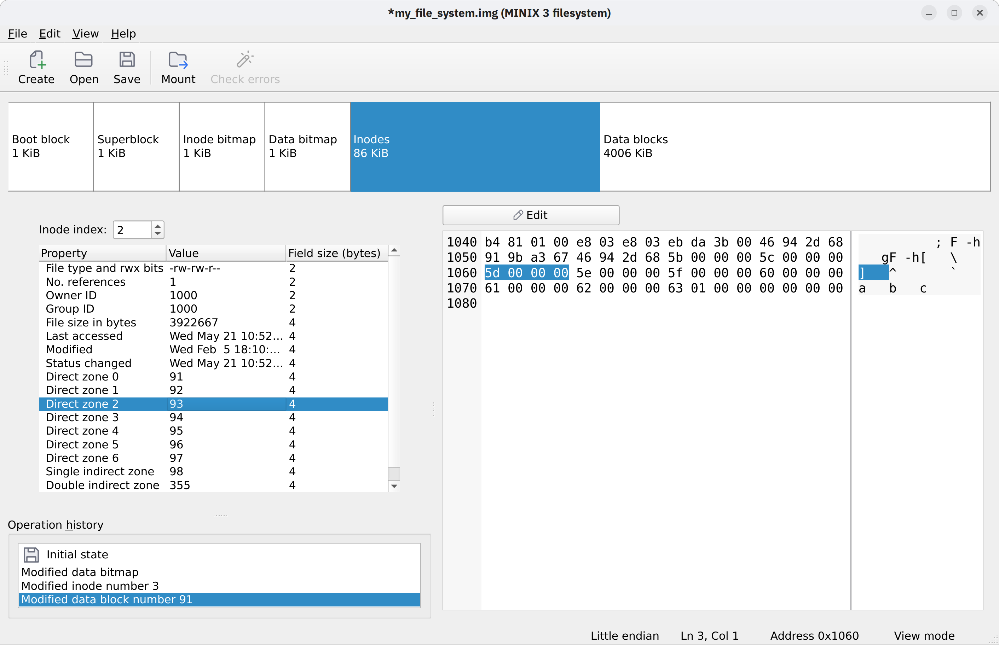

# Shardine

Shardine is a filesystem viewer and editor, aimed at helping students understand filesystem design and implementation.
Shardine allows you to create and open raw disk images (`.img` files) to view their layout, edit them, and mount them as regular filesystems.

Shardine is distributed as an AppImage: download it, make it executable and run it. [Download the latest release here](https://github.com/vcastilla/Shardine/releases/latest)

## Features

- View the fields of internal structures from a filesystem (i.e. bitmaps, inodes, data blocks...)
- Edit any internal structure
- Use the operation history to undo/redo any changes
- Mount the filesystem to see external changes in real time
- Check filesystem consistency to catch mistakes

See the full overview of features in the [wiki page](https://github.com/vcastilla/Shardine/wiki/Application-features).
Currently, only MINIX V3 filesystems are supported.

## Building from source

To build from source, you need to install CMake &geq; 3.22 and [vcpkg](https://vcpkg.io).
Then, simply run

    cmake . -DCMAKE_BUILD_TYPE=Release `-DCMAKE_TOOLCHAIN_FILE=/path/to/vcpkg`

from the command line, substituting `/path/to/vcpkg` with the path to your vcpkg installation directory.
